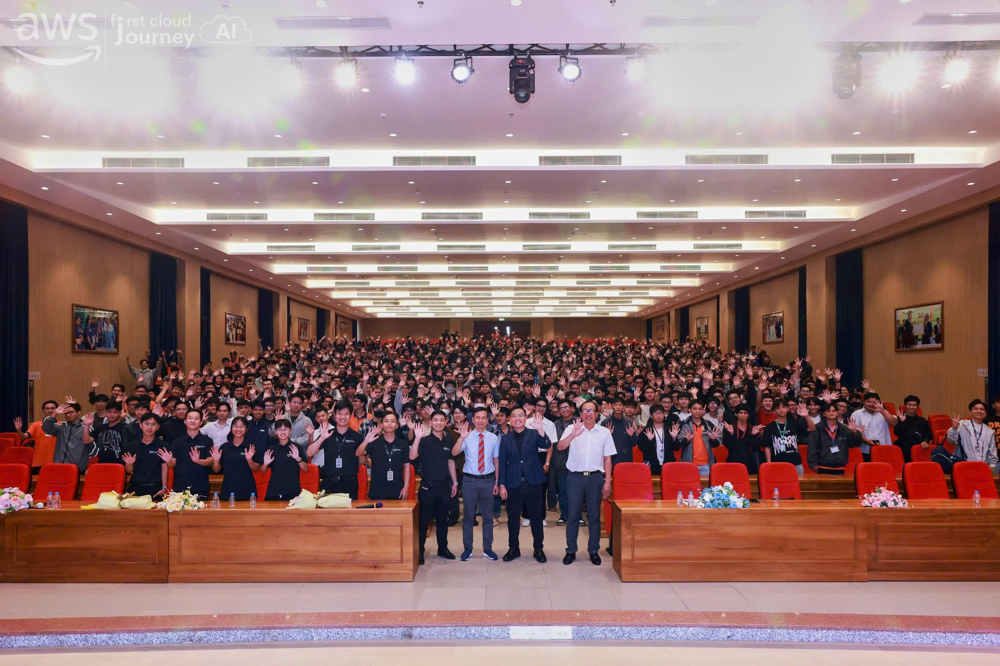

# Bài thu hoạch "FCAJ - HUTECH Kickoff"

### Mục tiêu & Tổng quan sự kiện

**FCAJ - HUTECH Kickoff** là sự kiện khởi động giúp sinh viên hiểu rõ hơn về cộng đồng First Cloud AI Journey, định hướng học tập trong lĩnh vực Cloud/AI và cách tham gia các hoạt động thực hành trong thời gian tới. Sự kiện không chỉ giới thiệu chương trình, mà còn giúp sinh viên hình dung rõ hơn việc học công nghệ cần gắn với workshop, dự án thực tế và tinh thần tự học.

### Thông tin tham dự sự kiện

- **Hình thức:** Tham dự trực tiếp
- **Địa điểm:** Trường HUTECH, khu E3
- **Vai trò:** Người tham dự

### Nội dung chính của sự kiện

#### Giới thiệu cộng đồng FCAJ

Ban tổ chức giới thiệu FCAJ như một cộng đồng học thuật dành cho sinh viên yêu thích công nghệ, đặc biệt là các chủ đề liên quan đến AWS Cloud, AI, DevOps và xây dựng sản phẩm thực tế. Thông qua cộng đồng, sinh viên có cơ hội tham gia workshop, trao đổi với mentor, làm việc nhóm và học hỏi từ các bạn có cùng định hướng.

Một số nội dung được nhấn mạnh:

- Mục tiêu và định hướng hoạt động của FCAJ
- Cách sinh viên tham gia các buổi training, workshop và seminar
- Vai trò của việc ghi chép, thực hành và chia sẻ lại kiến thức
- Tầm quan trọng của cộng đồng trong quá trình học Cloud và AI

#### Định hướng First Cloud Journey

Sự kiện giúp tôi hiểu rằng việc học AWS nên bắt đầu từ nền tảng, sau đó từng bước thực hành với các dịch vụ cốt lõi. Thay vì học quá nhiều dịch vụ cùng lúc, người mới nên hiểu mỗi dịch vụ giải quyết vấn đề gì và được dùng trong tình huống nào.

Các dịch vụ nền tảng được nhắc đến gồm:

- **IAM:** Quản lý danh tính, phân quyền và nguyên tắc least privilege
- **S3:** Lưu trữ object, static website hosting và quản lý dữ liệu
- **EC2:** Máy chủ ảo dùng để triển khai ứng dụng cơ bản
- **VPC:** Mạng riêng, subnet, route table và security group
- **RDS/DynamoDB:** Lưu trữ dữ liệu quan hệ hoặc NoSQL
- **CloudWatch:** Theo dõi log, metric và trạng thái hệ thống

#### Chia sẻ từ diễn giả và cộng đồng

Các chia sẻ trong sự kiện cho thấy kiến thức trên lớp là nền tảng quan trọng, nhưng để sẵn sàng cho môi trường làm việc thực tế thì sinh viên cần chủ động thực hành nhiều hơn. Việc tham gia cộng đồng, làm project và ghi lại quá trình học giúp thu hẹp khoảng cách giữa lý thuyết và yêu cầu công việc.

### Kiến thức và kỹ năng học được

#### Kỹ năng chuyên môn

- Hiểu cách một ứng dụng web hoạt động từ frontend, backend đến database
- Biết vai trò của các dịch vụ AWS cơ bản trong một hệ thống cloud
- Nhận thức được tầm quan trọng của bảo mật tài khoản, IAM và kiểm soát chi phí
- Làm quen với tư duy thiết kế kiến trúc trước khi triển khai project

#### Kỹ năng mềm

- Chủ động tự học và đặt câu hỏi khi gặp vấn đề
- Ghi chép quá trình học để dễ theo dõi và chia sẻ lại
- Làm việc nhóm, trao đổi ý tưởng và tiếp nhận feedback
- Quản lý thời gian khi tham gia workshop hoặc dự án thực tế

### Giá trị của việc tham gia cộng đồng

Thông qua sự kiện, tôi nhận thấy cộng đồng là một môi trường rất quan trọng đối với người mới học cloud. Khi tự học một mình, sinh viên dễ bị quá tải vì AWS có nhiều dịch vụ và khái niệm. Khi tham gia cộng đồng, người học có thể đi theo lộ trình rõ ràng hơn, hỏi khi gặp lỗi và học từ kinh nghiệm của người đi trước.

Đối với bản thân tôi, FCAJ là cơ hội để:

- Có định hướng học AWS rõ ràng hơn
- Được tiếp cận với workshop và project thực tế
- Rèn luyện kỹ năng làm việc nhóm
- Mở rộng góc nhìn về nghề nghiệp trong lĩnh vực Cloud/AI

### Liên hệ với quá trình thực tập và dự án CloudDoc

Sau sự kiện, tôi có thêm định hướng khi tham gia chương trình thực tập và dự án nhóm CloudDoc. Với vai trò phụ trách frontend và hỗ trợ vẽ sơ đồ kiến trúc, tôi nhận thấy việc hiểu các thành phần cloud cơ bản giúp trình bày luồng hệ thống rõ ràng hơn, đặc biệt là mối liên hệ giữa giao diện người dùng, backend, lưu trữ dữ liệu và hạ tầng AWS.

Những kiến thức từ sự kiện cũng giúp tôi chú ý hơn đến:

- Cách thiết kế sơ đồ kiến trúc dễ hiểu cho nhóm
- Cách frontend tương tác với backend/API
- Tầm quan trọng của bảo mật, phân quyền và kiểm soát chi phí khi triển khai trên AWS
- Việc ghi chép quá trình làm việc để phục vụ báo cáo thực tập

### Nhận thức cá nhân

Sau khi tham gia **FCAJ - HUTECH Kickoff**, tôi hiểu rằng học công nghệ không nên chỉ dừng ở việc đọc lý thuyết. Người học cần tham gia các hoạt động thực tế, tự triển khai thử, gặp lỗi, sửa lỗi và ghi lại kinh nghiệm. Đặc biệt với cloud, việc học theo từng bước nhỏ sẽ hiệu quả hơn nhiều so với cố gắng học thật nhiều dịch vụ cùng lúc.

Sự kiện giúp tôi có thêm động lực để tiếp tục tham gia các hoạt động của FCAJ, hoàn thành tốt các tuần thực tập và áp dụng kiến thức đã học vào dự án CloudDoc.

### Một số hình ảnh khi tham gia sự kiện

> Tổng thể, sự kiện FCAJ - HUTECH Kickoff giúp tôi có định hướng rõ ràng hơn về hành trình học Cloud/AI, đồng thời nhấn mạnh vai trò của thực hành, cộng đồng và dự án thực tế trong quá trình phát triển kỹ năng.
